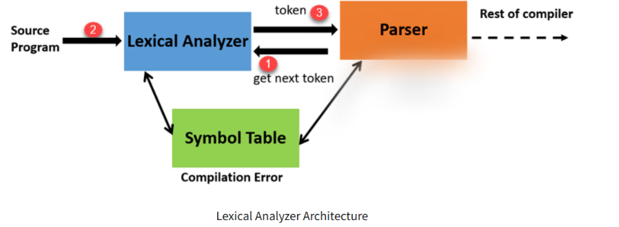

## Basic Terms 

### Token 
Tokens in compiler design are the sequence of characters which represents a unit of information in the source program.

### lexeme
A lexeme is a sequence of characters that are included in the source program according to the matching pattern of a token. 
It is nothing but an instance of a token.

### Pattern 
A pattern is a description which is used by the token. 
In the case of a keyword which uses as a token, the pattern is a sequence of characters.

## An introduction to Lexical Analysis 
Lexical Analysis is the very first phase in the compiler designing.
A Lexer helps you to convert a sequence of characters into a sequence of tokens. 
Lexical analyzer scans the entire source code of the program. It identifies each token one by one.

## How tokens are recognized

## lexer.lex
In [`src/lexer.lex`](../src/lexer.lex) contains the specification of the scanner , which is resposible for tokenizing the input code. 
In general a lexical analyser can be described by a set of patterns related to the actions to be performed when a pattern matches.

This file uses the flex lexer generator tool. So corresponding to every `tokens regex` there is a subsequent `action` . 
look at lines 12-25 in `lexer.lex`.
Here the action is to return the corresponding token that is described in  `src/parser.yy` (lines 28-31) . 
