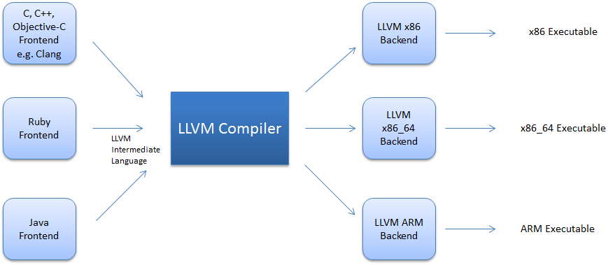

# LLVM Codegen
In [`src/llvmcodegen.cc`](../src/llvmcodegen.cc), we recursively traverse the tree and generate equivalent LLVM IR.

## An introduction to LLVM
LLVM is a very popular compiler infrastructure for C and other languages, including Rust. LLVM can provide the middle layers of a complete compiler system, taking intermediate representation (IR) code from a compiler and emitting an optimized IR. This new IR can then be converted and linked into machine-dependent assembly language code for a target platform.



We will be using the LLVM toolchain to convert our baseline language into LLVM IR.

## LLVM IR
The core of LLVM is the intermediate representation (IR), a low-level programming language similar to assembly. IR is a strongly typed reduced instruction set computer (RISC) instruction set which abstracts away most details of the target(e.g. x86 ISA). Also, instead of a fixed set of registers, IR uses an infinite set of temporaries of the form %0, %1, etc. LLVM IR follows static single assignment form.([SSA](https://en.wikipedia.org/wiki/Static_single-assignment_form)). SSA requeries each variable to be assigned exactly once. For example,

```
y := 1
y := 2
x := y
```

would be written in SSA form as,

```
y1 := 1
y2 := 2
x := y2
```

SSA allows many compiler optimizations (like [constant folding](https://en.wikipedia.org/wiki/Constant_folding) e.g. converting `a = 3 * 4 + 5` into `a = 17`). It is important to note that our baseline language is not in SSA. The LLVM toolchain has the functionality that allows us to generate SSA withought worrying too much about generating fresh variables for new assignments.

## [`src/llvmcodegen.cc`](../src/llvmcodegen.cc)
[`src/llvmcodegen.cc`](../src/llvmcodegen.cc) handles generation of LLVM IR from the AST parsed from the baseline language. The main functions in [`src/llvmcodegen.cc`](../src/llvmcodegen.cc) are `void LLVMCompiler::compile(Node *root)` and the abstract function of the `Node` ``

